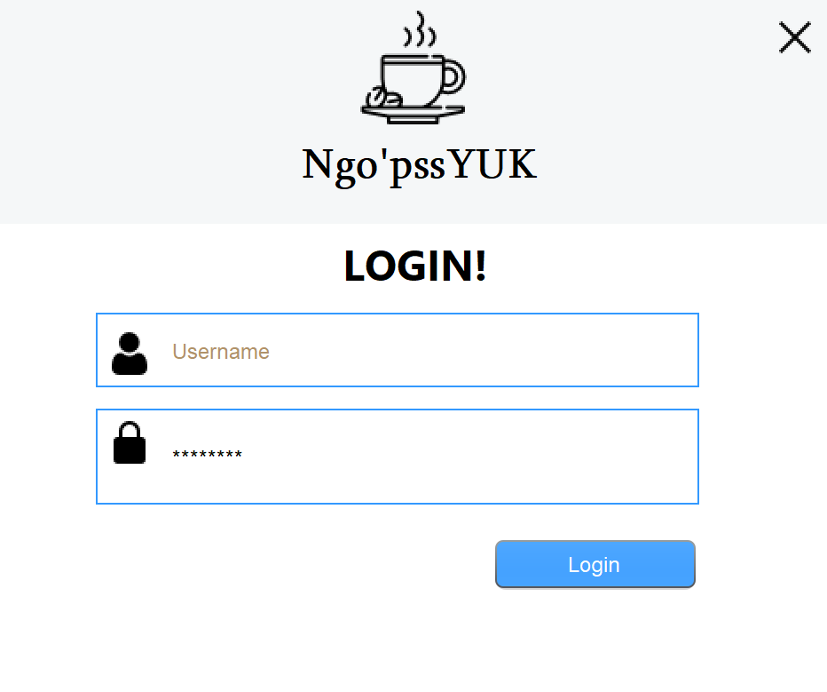
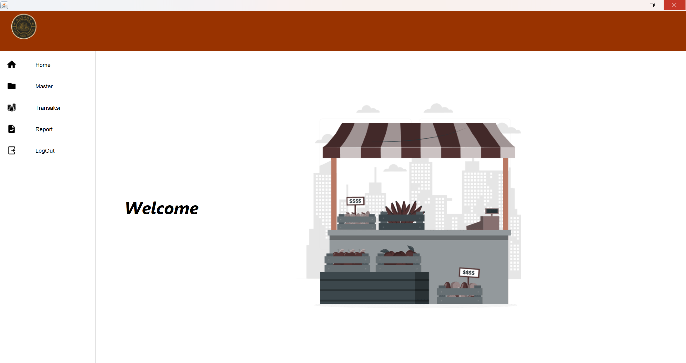
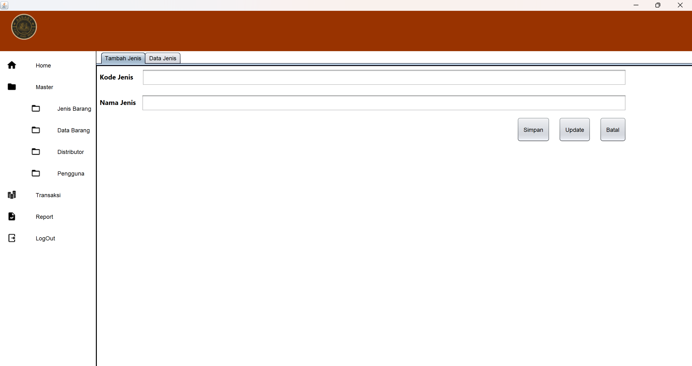
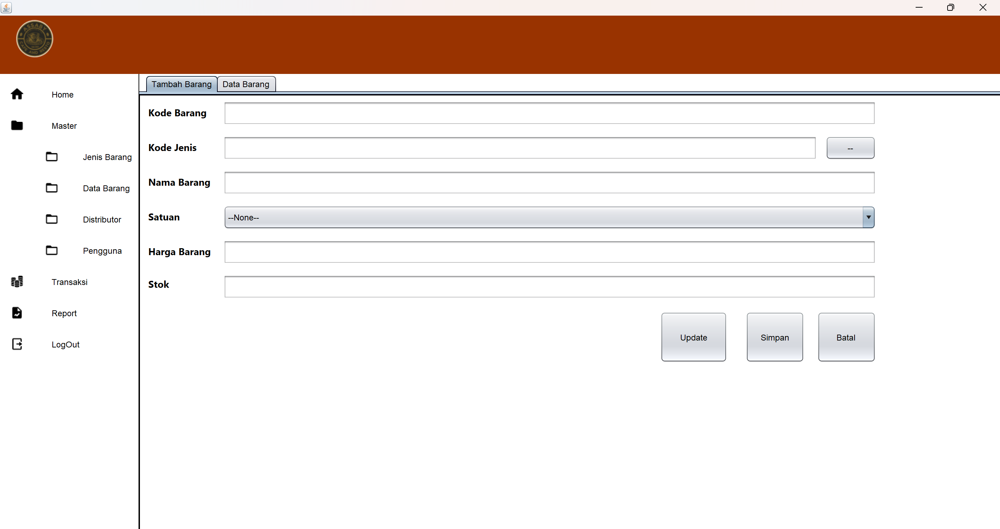
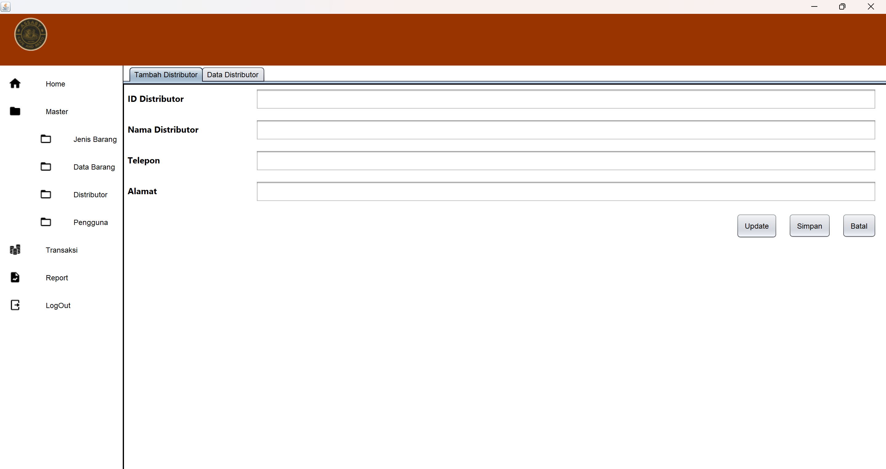
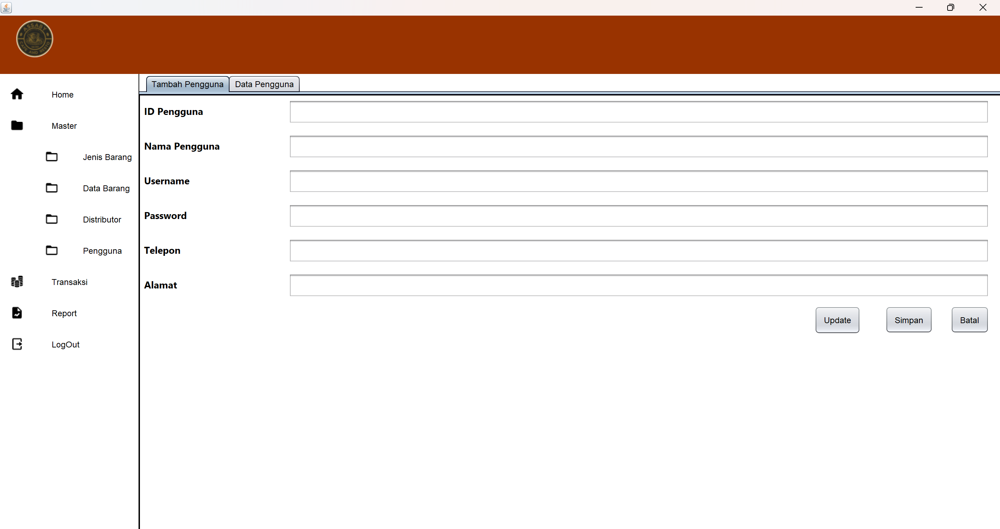
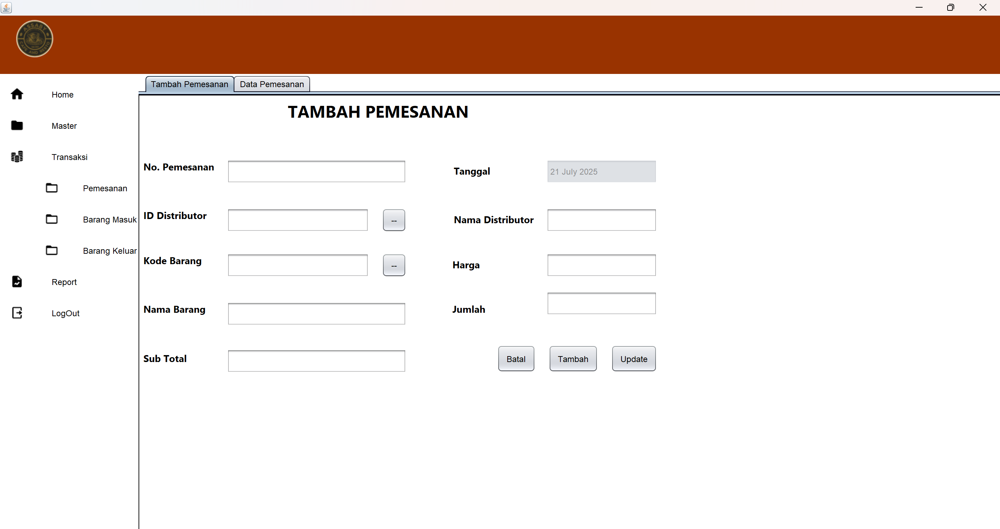
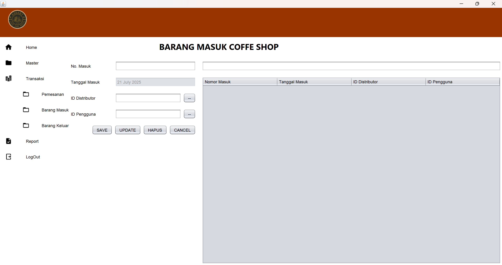
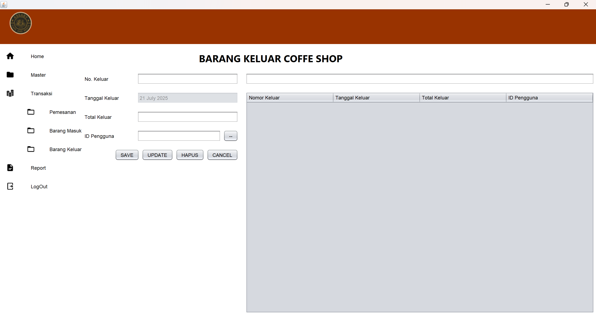

# 💼 Java POS (Point of Sale) Application

Sistem Point of Sales berbasis deskop yang sederhana dan dikembangkan dengan menggunakan JAVA GUI. Aplikasi ini digunakan untuk mengelola penjualan skala kecil, penyimpanan barang, dan transaksi barang.
---

# 📸 Preview


















---

# ✨ Fitur Utama

- 🛒 Kelola Produk (CRUD)
- 📦 Manajemen Stok
- 🧾 Transaksi Penjualan
- 📊 Laporan Penjualan
- 👥 Manajemen Pengguna (Admin dan Kasir)
- 💾 Penyimpanan data dengan MySQL
  
---

# 🛠️ Teknologi yang Digunakan

- Java (Swing GUI)
- MySQL
- JDBC
- NetBeans IDE

---

# 📦 Cara Menjalankan Proyek Ini

## 1. Clone Repositori
   ```bash
   git clone https://github.com/Abdan0/Java_POS.git
   cd Java_POS
